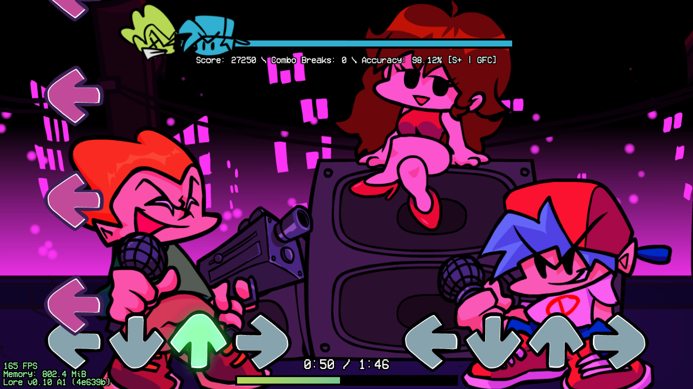

 

# Lore Engine Legacy
    

Lore Engine Legacy is a modification for Friday Night Funkin', based on version 0.6.3 of Psych Engine.

Over that version of Psych Engine, its main additional features are:

- Haxe scripting support
- Custom and overrideable states
- Built-in support for shaders formatted for Shadertoy (some modifications required in some cases)
- Per-character noteskins
- Hitsounds
- Added Lua API functions
- Separate vocal tracks
- General aesthetic and usability improvements

# Documentation
Lore Engine Legacy is primarily undocumented. Documentation is in the works, but it will likely be a bit of time before it's in a state I'm comfortable with making available. If you can't gleam how something works from the source code, feel free to shoot me a DM on [Bluesky](https://bsky.app/profile/dotevie.com),

# Building
See [wiki page](https://github.com/dotevie/lore-engine-legacy/wiki/How-to-compile-Lore-Engine).

# License

### Lore Engine Legacy is free software. From version 0.5.0 onward, it is licensed under version 3.0 of the GNU General Public License. This is a permissive license, not dissimilar to Apache, but it does have a few more obligations for derivatives (e.g. forks or source mods) or software that uses code from Lore Engine Legacy. The primary obligation is that, if you distribute any software that falls into that cateory, you should distribute the source code, and also license it under GPL. If you think this applies to you, please see the [LICENSE](LICENSE) file for more information.

# Screenshots

